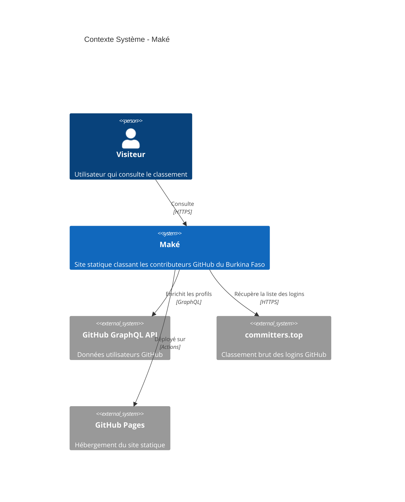
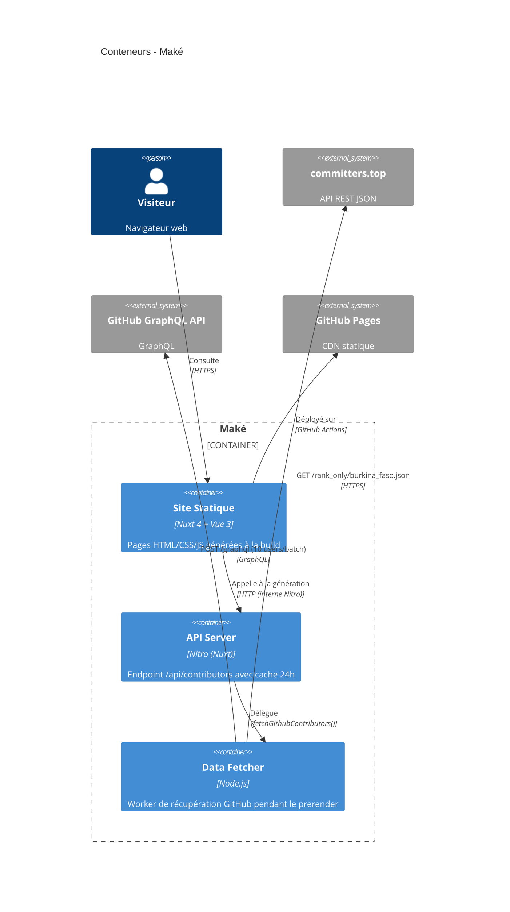
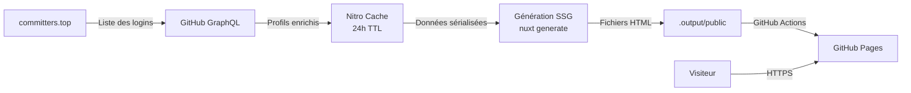

# Architecture — Maké

> Document d'architecture logicielle (SAD) basé sur le modèle C4.  
> **Projet :** Maké — Classement des contributeurs GitHub du Burkina Faso  
> **Auteur :** YAOGO Gérard Windpagnandé

---

## 1. Contexte (C4 Level 1)

---

## 2. Conteneurs (C4 Level 2)

---

## 3. Décisions d'Architecture (ADR)

### ADR-001 : Monolithe modulaire Nuxt

| Champ | Valeur |
|---|---|
| **Statut** | ACCEPTÉ |
| **Contexte** | Projet solo, site statique à page unique. Pas de besoin de scalabilité horizontale. |
| **Décision** | Architecture monolithique Nuxt 4 en SSG. Le code serveur (`server/`) et client (`app/`) cohabitent dans le même projet. |
| **Conséquences** | Déploiement simplifié (un seul artefact `.output/public/`). La séparation modules `server/` vs `app/` suffit pour le périmètre. |

### ADR-002 : Cache 24h côté serveur

| Champ | Valeur |
|---|---|
| **Statut** | ACCEPTÉ |
| **Contexte** | L'API GitHub a des limites de rate (5000 req/h). Les données de contributions n'ont pas besoin d'être temps réel. |
| **Décision** | Cache Nitro storage avec TTL de 24h. La fraîcheur est garantie par le cron GitHub Actions quotidien. |
| **Conséquences** | Pas de requête à l'API GitHub pendant la navigation. Les données sont toujours figées à la dernière génération. |

### ADR-003 : Génération statique (SSG) plutôt que SPA/SSR

| Champ | Valeur |
|---|---|
| **Statut** | ACCEPTÉ |
| **Contexte** | Hébergement gratuit sur GitHub Pages (fichiers statiques uniquement). Pas de backend runtime. |
| **Décision** | `nuxt generate` produit des fichiers HTML pré-rendus. L'appel à l'API est fait **au moment de la build** via `useFetch()`. |
| **Conséquences** | Zéro infrastructure serveur. Le cron régénère le site complet si les données changent. |

---

## 4. Stack Technique

| Couche | Technologie | Version |
|---|---|---|
| Framework | Nuxt 4 (SSG) | ^4.4.6 |
| UI | Vue 3 + Composition API | ^3.5.34 |
| Styling | Tailwind CSS (via `@nuxtjs/tailwindcss`) | ^6.14.0 |
| Dark mode | `@nuxtjs/color-mode` | ^4.0.0 |
| i18n | `@nuxtjs/i18n` | ^10.4.0 |
| Backend | Nitro (intégré Nuxt 4) | — |
| Base de données | Aucune (fichiers statiques + cache storage) | — |
| API externe | GitHub GraphQL API | v4 |
| API externe | committers.top | REST |
| CI/CD | GitHub Actions | — |
| Hébergement | GitHub Pages | — |
| Runtime build | Node.js | 22 |
| Langage | TypeScript | — |

---

## 5. Flux de données (vue d'ensemble)

---

## 6. Sécurité

- Le token GitHub (`NUXT_GITHUB_TOKEN`) est injecté via GitHub Actions secrets, jamais exposé au client.
- Aucune donnée utilisateur n'est stockée (lecture seule depuis GitHub).
- Aucune authentification sur le site (données publiques).
- TLS 1.3 assuré par GitHub Pages.
