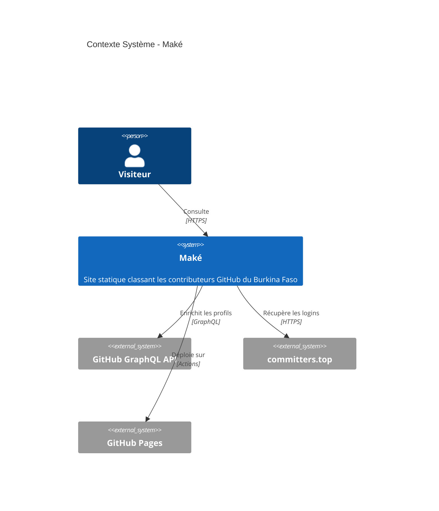
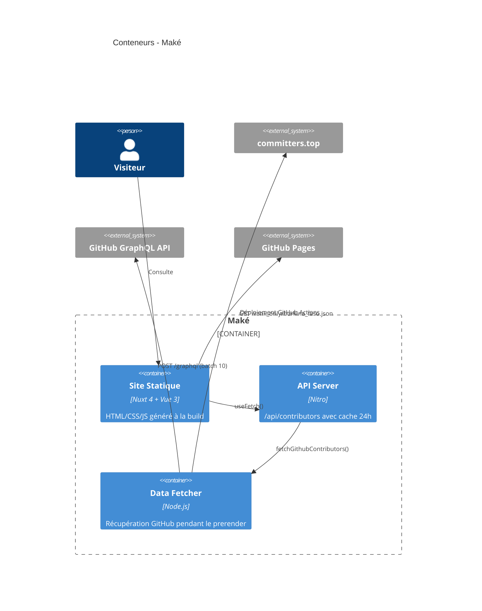

# Architecture — Maké

> C4 Context + Container, ADR, stack.  
> 📖 Recommandé avant toute autre lecture.

**[→ Lire : Pipeline de données](data-pipeline.md)**

## Contexte (C4 Level 1)

## Conteneurs (C4 Level 2)

## Décisions d'Architecture

| ADR | Décision | Pourquoi |
|---|---|---|
| 001 | Monolithe modulaire Nuxt | Projet solo, pas de scalabilité nécessaire |
| 002 | Cache 24h Nitro | Éviter rate limit GitHub, données pas temps réel |
| 003 | SSG plutôt que SSR/SPA | GitHub Pages = fichiers statiques uniquement |

## Stack

| Couche | Technologie |
|---|---|
| Framework | Nuxt 4 (SSG) |
| UI | Vue 3 + Composition API |
| Styling | Tailwind CSS + glassmorphism |
| Dark mode | `@nuxtjs/color-mode` |
| i18n | `@nuxtjs/i18n` (FR/EN) |
| Backend | Nitro (intégré Nuxt) |
| APIs | GitHub GraphQL v4 + committers.top |
| CI/CD | GitHub Actions |
| Hébergement | GitHub Pages |
| Build | Node.js 22, TypeScript |

## Sécurité

- Token GitHub injecté via secrets, jamais exposé au client
- Aucune donnée stockée (lecture seule)
- TLS 1.3 via GitHub Pages

## Références

- [SWE Basics Before Code](https://github.com/MatrixCollab/SWE-BASICS-BEFORE-CODE) — Méthodologie complète (Waterfall, IEEE 830, C4 Model, UML) qui a inspiré la structure de cette documentation.
