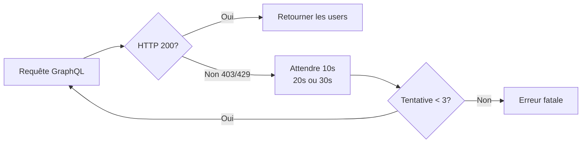

# Pipeline de Données — Maké

> Parcours complet des données : de l'API GitHub jusqu'à l'affichage dans le navigateur.

---

## 1. Vue d'ensemble

```mermaid
flowchart TD
  A[committers.top] -->|1. Logins| B[fetchRankedLogins]
  B -->|2. Tableau de logins| C[fetchGithubContributors]
  C -->|3. BATCH 10 users| D[buildBatchQuery]
  D -->|4. GraphQL POST| E[GitHub GraphQL API]
  E -->|5. Profils JSON| F[fetchBatch]
  F -->|6. Agrégation + Tri| G[Contributor[]]
  G -->|7. Stockage cache 24h| H[Nitro Storage]
  H -->|8. useFetch /api/contributors| I[Prerender Nuxt]
  I -->|9. HTML statique| J[Site déployé]
```

---

## 2. Étape 1 — Récupération des logins

`fetchRankedLogins()` dans `server/utils/github.ts`

- Appelle `https://committers.top/rank_only/burkina_faso.json`
- Récupère un tableau JSON de logins GitHub classés par contributions
- ~200-300 utilisateurs

```typescript
async function fetchRankedLogins(): Promise<string[]> {
  const res = await fetch(COMMITTERS_TOP_URL);
  const json = JSON.parse(await res.text());
  return json.user ?? [];
}
```

---

## 3. Étape 2 — Enrichissement par batch GraphQL

`fetchGithubContributors()` traite les logins par paquets de 10 avec 1s de délai entre chaque batch.

**Requête GraphQL (par batch) :**

```graphql
query {
  u0: user(login: "...") {
    login, name, avatarUrl, bio, company
    followers { totalCount }
    repositories(first: 10, orderBy: {field: STARGAZERS, direction: DESC}) {
      totalCount
      nodes { stargazerCount }
    }
    contributionsCollection(from: "2026-01-01T00:00:00Z") {
      contributionCalendar { totalContributions }
      totalCommitContributions
    }
  }
  # ... jusqu'à u9
}
```

**Mécanisme de retry :**



---

## 4. Étape 3 — Agrégation et tri

Après tous les batches, les utilisateurs sont triés par `totalContributions` descendant.

```typescript
allUsers.sort((a, b) => bC - aC);
```

Chaque utilisateur est mappé vers l'interface `Contributor` :

| Champ | Source |
|---|---|
| `rank` | Index du tri + 1 |
| `name` | `user.name` sinon `user.login` |
| `pseudo` | `@user.login` |
| `status` | `"étudiant"` si bio/company contient un mot-clé, sinon `"contributeur"` |
| `contributions` | `contributionCalendar.totalContributions` |
| `repos` | `repositories.totalCount` |
| `stars` | Somme des `stargazerCount` des 10 premiers repos |
| `avatar` | `user.avatarUrl` |

Mots-clés étudiants reconnus : `étudiant`, `étudiante`, `etudiant`, `etudiante`, `student`

---

## 5. Étape 4 — Cache 24h

`server/api/contributors.get.ts`

```typescript
const cached = await storage.getItem('github-contributors')
if (cached && Date.now() - cached.timestamp < 24h) {
  return cached.data  // ← les visiteurs reçoivent toujours le cache
}
const data = await fetchGithubContributors()  // ← seulement à la génération
await storage.setItem('github-contributors', { timestamp: Date.now(), data })
```

Le cache garantit :
- Pas de requêtes GitHub pendant la navigation
- Temps de réponse quasi-instantané
- Données cohérentes jusqu'à la prochaine génération

---

## 6. Étape 5 — Génération statique

Pendant `nuxt generate`, le prerender exécute `useFetch('/api/contributors')` dans `index.vue`. Nitro fait tourner un serveur local qui répond à cet appel, déclenchant la chaîne complète (ou servant le cache).

Le résultat est un fichier HTML statique avec les données déjà injectées. Zéro JavaScript nécessaire pour le rendu initial des données.

---

## 7. Données par déploiement

| Mètre | Valeur typique |
|---|---|
| Logins depuis committers.top | ~250-350 |
| Requêtes GraphQL | ~25-35 (10 users/batch) |
| Durée du fetch | ~30-60s (avec délais 1s/batch + retry) |
| Taille du fichier JSON final | ~50-100 Ko |
| Génération SSG | < 30s |
