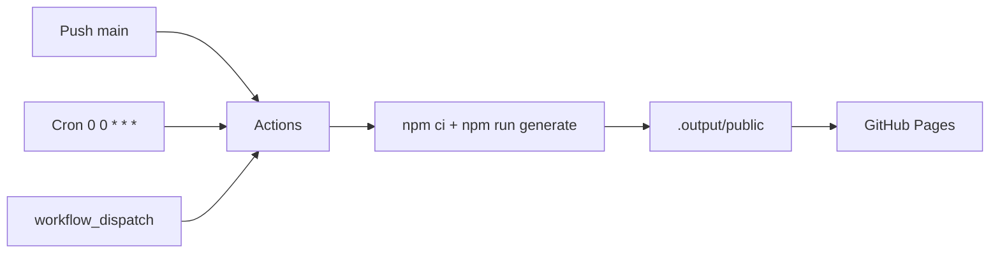

# Déploiement — Maké

> CI/CD GitHub Actions → GitHub Pages.



## Workflow

Déclenché par **push sur `main`**, **cron quotidien minuit UTC**, ou **déclenchement manuel**.

```bash
npm ci && npm run generate
```

## Secrets

| Secret | Description |
|---|---|
| `NUXT_GITHUB_TOKEN` | Token GitHub classic (scope `read:user`) |

## Configuration Pages

Dans **Settings → Pages** : Source = **GitHub Actions**.

Le site est servi sur `https://yaogogerard.github.io/Make/` (baseURL `/Make/`).

## Dépannage rapide

| Problème | Solution |
|---|---|
| Build failed: `Impossible de contacter committers.top` | Attendre, relancer manuellement |
| Build failed: `Bad credentials` | Régénérer le secret `NUXT_GITHUB_TOKEN` |
| Pages pas à jour malgré build OK | Attendre ~5 min (cache CDN) |
| Site blanc | Vérifier `baseURL: '/Make/'` dans `nuxt.config.ts` |
