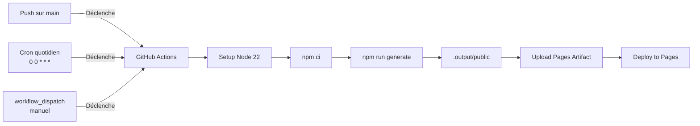

# Déploiement — Maké

> CI/CD et hébergement du site statique.

---

## 1. Architecture de déploiement



---

## 2. Workflow

Fichier : `.github/workflows/deploy.yml`

```yaml
on:
  push:
    branches: [main]
  schedule:
    - cron: '0 0 * * *'
  workflow_dispatch:
```

**Déclencheurs :**
- **Push** sur `main` → déploiement immédiat
- **Cron** `0 0 * * *` → reconstruction quotidienne (données fraîches)
- **Manuel** via l'onglet Actions de GitHub

---

## 3. Secrets requis

| Secret | Valeur |
|---|---|
| `NUXT_GITHUB_TOKEN` | Token GitHub classic avec scope `read:user` |

Configurer dans : **Settings → Secrets and variables → Actions**

---

## 4. Étapes de build

```bash
npm ci          # Installation propre (basée sur package-lock.json)
npm run generate # Génération SSG
```

La variable d'environnement `NUXT_GITHUB_TOKEN` est injectée automatiquement par GitHub Actions.

---

## 5. Artefact de déploiement

Le dossier `.output/public/` est uploadé comme artifact GitHub Pages, puis déployé.

```yaml
- uses: actions/upload-pages-artifact@v3
  with:
    path: .output/public
- uses: actions/deploy-pages@v4
```

---

## 6. Configuration GitHub Pages

Dans **Settings → Pages** :

| Option | Valeur |
|---|---|
| Source | **GitHub Actions** |
| Branche | `main` (le workflow s'en charge) |

---

## 7. Base URL

Le site est servi sur `https://yaogogerard.github.io/Make/`. La configuration Nuxt reflète ce chemin :

```typescript
// nuxt.config.ts
app: {
  baseURL: '/Make/'
}
```

Tous les chemins d'assets (CSS, JS, favicon) sont automatiquement préfixés.

---

## 8. Dépannage

| Problème | Cause possible | Solution |
|---|---|---|
| Build failed : `Impossible de contacter committers.top` | committers.top down | Attendre, ou relancer manuellement |
| Build failed : `Bad credentials` | Token invalide | Régénérer le secret `NUXT_GITHUB_TOKEN` |
| Build failed : rate limit | Trop de requêtes GitHub | Vérifier le retry log dans les logs Actions |
| Pages non mises à jour malgré build OK | Cache GitHub Pages | Attendre ~5 min ou faire un déploiement vide |
| Site en blanc | BaseURL incorrecte | Vérifier que `assetsDir` et `baseURL` sont cohérents |

---

## 9. URLs utiles

| Ressource | URL |
|---|---|
| Site | https://yaogogerard.github.io/Make/ |
| Dépôt | https://github.com/YaogoGerard/Make |
| Workflows | https://github.com/YaogoGerard/Make/actions |
| Pages config | https://github.com/YaogoGerard/Make/settings/pages |
